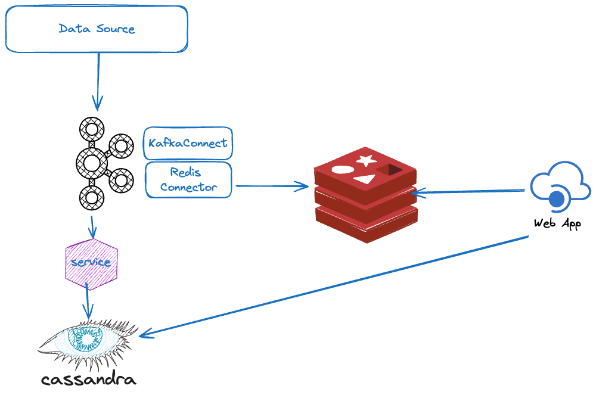

# Transactions

This is a simple Python and Flask app to ingest data from Kafka and store in Redis. It supports searching the data. It uses Flask as the web server since it's so easy to get up and running.

## Architecture

This is a simplified diagram of using Kafka to get data into Cassandra (via a microservice) as well as into Redis using KafkaConnect and our Redis Kafka Connector.



See [Redis Kafka Connector](https://redis-field-engineering.github.io/redis-kafka-connect/)

## Data Schema

The data schema is a JSON object consisting of the folling:

```json
{
    "id": "string",
    "description": "string",
    "from_account": "string",
    "to_account": "string",
    "user_id": "string",
    "amount": 5000.23,
    "date": 1700254885,
}
```

See [test_data.json](./app/resources/test_data.json) for an example.

## Prerequisites

- Python 3.11 or greater
- Redis

## Installing
This is how I recommend doing things, if you're on a Mac

```bash
python3 -m venv .venv
source ./.venv/bin/activate
```

```bash
pip install -r requirements.txt
```

## Running
```bash
flask run
```

The app is running here by default [http://localhost:5000](http://localhost:5000)

## Docker
You may run this service plus the Redis database from docker. We've provided a docker-compose files for the service,
as well as for Redis. You must build the service image, then run docker-compose to bring it up.

By default, this app is listening on port 5050, Redis on 6379

```bash
docker-compose build
docker-compose up -d
```

The app is found here by default when running with docker: [http://localhost:5050](http://localhost:5050)

## Testing
```bash
pytest
```

Note the tests rely on a running Redis. I'll update this someday to use https://testcontainers-python.readthedocs.io/en/latest/README.html.

For now, it's easiest to just run the docker redis-stack image, e.g.,
```bash
docker run -d --name redis-stack-server -p 6379:6379 redis/redis-stack-server:latest
```

## Code
The main "router" for the various endpoints is found in [__init__.py](app/__init.py__). From there you should be able to trace the
rest of the code.

Controllers are in `app/controllers`

Utility functions are in `app/utility`

The code for searching the Redis database is in [search_controller.py](./app/controllers/search_controller.py)

There's a file [make_index.py](./app/make_index.py) to generate the Redis search index. This is where you define the "schema" for searching.

There's a file [ingest_data.py](app/ingest_data.py) to read JSON data from a file and write to Redis. The search index is updated automatically.

